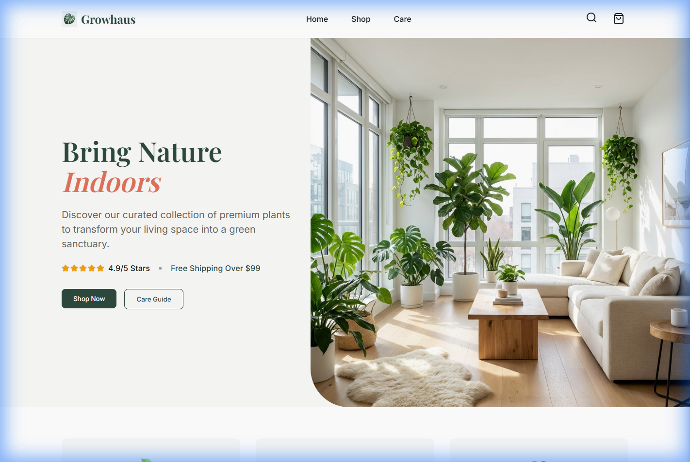
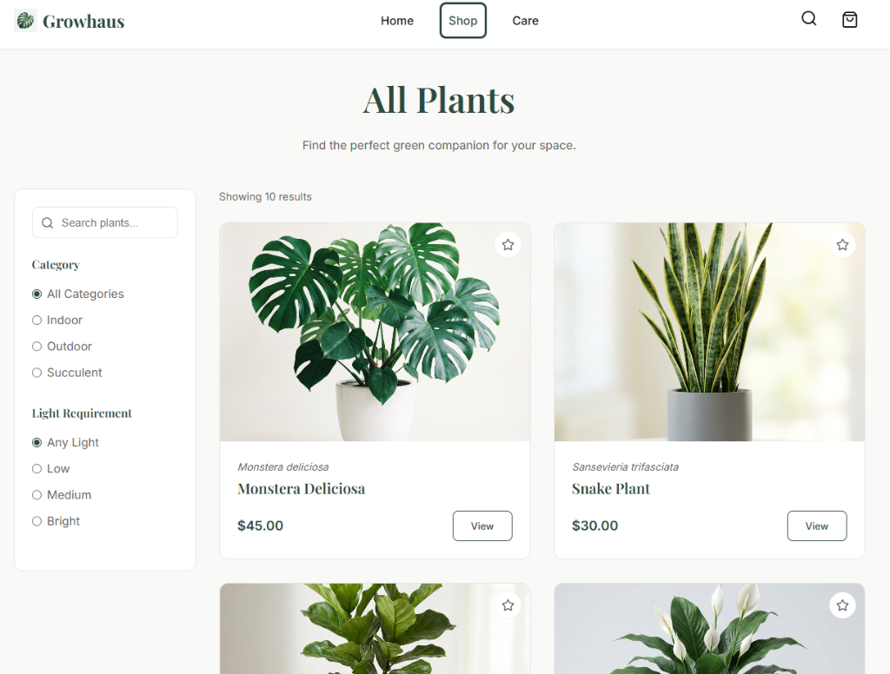
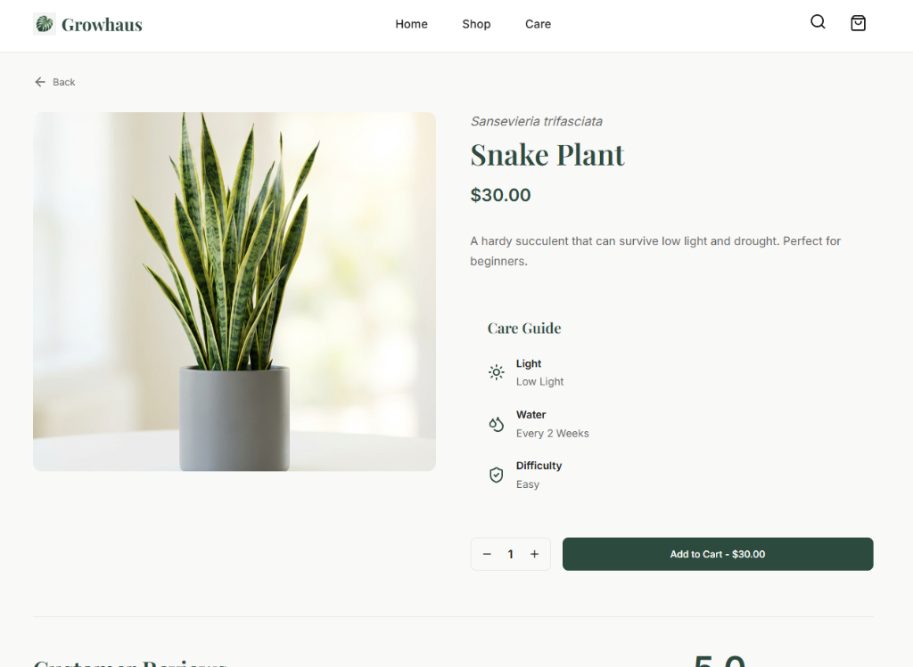

# 🌿 Growhaus - Premium Plant Shop

A beautiful, modern e-commerce website for plant enthusiasts, built with React, TypeScript, and a focus on premium design and user experience.



## 📖 About

**Growhaus** is your premier destination for bringing life into your living spaces. We believe that every home deserves a touch of nature, and our curated collection reflects that philosophy. From air-purifying indoor plants to resilient succulents and statement outdoor pieces, Growhaus offers a seamless shopping experience for plant lovers of all levels.

Our design philosophy centers on "Modern Organic" aesthetics—blending the raw beauty of nature with clean, contemporary web design. With a soothing palette of deep forest greens and warm creams, combined with elegant typography, we invite you to explore a digital sanctuary that feels as refreshing as the plants we sell.

## ✨ Features

### 🏠 Beautiful Home Page
- **Hero Section**: Eye-catching hero with compelling call-to-action
- **Social Proof**: Trust-building metrics (4.9/5 stars) and customer benefits (Free Shipping Over $99)
- **Featured Products**: Showcase of trending plants
- **Value Propositions**: Highlighting sustainability, secure shipping, and expert support
- **Newsletter Signup**: Build your green community


### 🛍️ Smart Shop Page
- **Product Catalog**: Clean grid layout with all available plants
- **Search Functionality**: Quick access via search icon in navbar
- **Advanced Filtering**: Filter by category (Indoor, Outdoor, Succulent) and light requirements (Low, Medium, Bright)
- **Responsive Design**: Mobile-friendly filter drawer
- **Real-time Results**: Instant product filtering



### 🌱 Detailed Product Pages
- **High-Quality Images**: Beautiful plant photography
- **Care Guides**: Visual indicators for light, water, and difficulty level
- **Quantity Selection**: Easy-to-use quantity controls
- **Add to Cart**: Seamless shopping experience



### 🛒 Shopping Cart
- **Slide-out Drawer**: Smooth cart animation
- **Quantity Management**: Adjust quantities or remove items
- **Live Totals**: Real-time price calculations
- **Local Storage**: Cart persists across sessions

### 📱 Mobile Navigation
- **Hamburger Menu**: Touch-friendly mobile menu button
- **Slide-out Drawer**: Smooth animation from the right
- **Full Navigation**: Access to all pages (Home, Shop, Care)
- **Overlay Backdrop**: Click outside to close
- **Body Scroll Lock**: Prevents background scrolling when menu is open

### ♿ Accessibility (WCAG 2.1 AA Compliant)
- **Keyboard Navigation**: Full keyboard support with Tab navigation
- **Focus States**: Visible 3px focus outlines on all interactive elements
- **ARIA Attributes**: Comprehensive labels, roles, and states
- **Screen Reader Support**: Descriptive labels and live regions
- **High Contrast**: All text exceeds WCAG AAA contrast ratios (10.8:1 to 16.1:1)
- **Focus Management**: Proper tab order and focus trap in mobile menu

### 🔒 Security Headers (Production)
- **HSTS**: Enforces HTTPS for 1 year with preload
- **Content Security Policy**: Mitigates XSS attacks with strict resource policies
- **X-Content-Type-Options**: Prevents MIME sniffing attacks
- **X-Frame-Options**: Prevents clickjacking
- **Referrer-Policy**: Controls referrer information for privacy
- **Permissions-Policy**: Disables unnecessary browser features

## 🎨 Design Philosophy

- **Modern Organic**: Blending contemporary web design with natural aesthetics
- **Beautiful Leaf Logo**: Elegant monstera deliciosa design with natural fenestrations
- **Color Palette**: 
  - Primary: Deep Forest Green (#2D4A3E)
  - Secondary: Sage Green (#8FBC8F)
  - Accent: Terracotta (#E2725B)
  - Background: Warm Cream (#F9F9F7)
- **Typography**: 
  - Headings: Playfair Display (serif)
  - Body: Inter (sans-serif)
- **Micro-interactions**: Smooth hover effects and animations throughout
- **Social Proof**: Trust signals and value propositions in hero section

## 🛠️ Tech Stack

- **Framework**: React 18 with TypeScript
- **Build Tool**: Vite
- **Routing**: React Router DOM
- **State Management**: React Context API
- **Styling**: Vanilla CSS with CSS Variables
- **Icons**: Lucide React
- **Version Control**: Git & GitHub
- **Deployment**: Netlify with security headers
- **Accessibility**: WCAG 2.1 AA compliant

## 🚀 Getting Started

### Prerequisites
- Node.js (v16 or higher)
- npm or yarn

### Installation

1. Clone the repository:
```bash
git clone https://github.com/Salvero/growhaus-plants.git
cd growhaus-plants
```

2. Install dependencies:
```bash
npm install
```

3. Start the development server:
```bash
npm run dev
```

4. Open your browser and navigate to `http://localhost:5173`

### Build for Production

```bash
npm run build
```

The production-ready files will be in the `dist` folder.

## 📁 Project Structure

```
growhaus-plants/
├── public/              # Static assets (images, logo, favicon)
├── src/
│   ├── components/      # Reusable UI components
│   │   ├── Button.tsx
│   │   ├── Navbar.tsx
│   │   ├── Footer.tsx
│   │   ├── Layout.tsx
│   │   └── CartDrawer.tsx
│   ├── pages/          # Page components
│   │   ├── Home.tsx
│   │   ├── Shop.tsx
│   │   ├── ProductDetails.tsx
│   ├── context/        # React Context providers
│   │   ├── CartContext.tsx
│   │   └── WishlistContext.tsx
│   ├── data/           # Mock data
│   │   ├── products.ts
│   ├── types/          # TypeScript type definitions
│   │   ├── index.ts
│   ├── App.tsx         # Main app component
│   ├── main.tsx        # Entry point
│   └── index.css       # Global styles
├── ACCESSIBILITY_REPORT.md  # Accessibility documentation
├── SECURITY_HEADERS.md      # Security implementation guide
├── SOCIAL_PROOF_IMPLEMENTATION.md  # Social proof documentation
├── package.json
├── netlify.toml        # Netlify deployment config with security headers
└── vite.config.ts
```

## 🌟 Key Features Implementation

### Cart Management
- Context API for global state management
- Local storage persistence
- Add, remove, and update quantities
- Real-time total calculations

### Product Filtering
- useMemo for optimized filtering
- Multiple filter criteria (category, light level)
- Responsive mobile filter drawer

### Responsive Design
- Mobile-first approach
- Breakpoints at 768px and 992px
- Touch-friendly interactions
- Mobile navigation menu with slide-out drawer

### Accessibility
- WCAG 2.1 Level AA compliant
- Keyboard navigation support
- Screen reader optimized
- High contrast ratios (10.8:1 to 16.1:1)
- Focus management and ARIA attributes

### Security
- HTTP security headers (HSTS, CSP, X-Content-Type-Options)
- OWASP Top 10 aligned
- PCI DSS and GDPR considerations
- Netlify deployment with security configuration

## 🎯 Future Enhancements

- [x] ~~Search functionality~~ ✅ Completed
- [x] ~~Wishlist functionality~~ ✅ Completed
- [x] ~~Mobile navigation menu~~ ✅ Completed
- [x] ~~Accessibility improvements~~ ✅ Completed
- [x] ~~Security headers~~ ✅ Completed
- [ ] User authentication
- [ ] Product reviews and ratings
- [ ] Checkout and payment integration
- [ ] Admin dashboard for inventory management
- [ ] More plant varieties and categories
- [ ] CSP tightening (remove unsafe-inline)
- [ ] Web Application Firewall (WAF)

## 👨‍💻 Author

**Salman**
- GitHub: [@Salvero](https://github.com/Salvero)
- Email: salmandev15@gmail.com

## 📄 License

This project is open source and available under the [MIT License](LICENSE).

## 🙏 Acknowledgments

- Plant images generated with AI
- Icons from [Lucide React](https://lucide.dev/)
- Fonts from [Google Fonts](https://fonts.google.com/)

---

**Made with 💚 and a love for plants**
